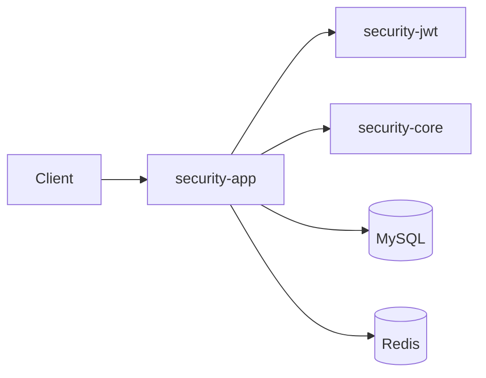
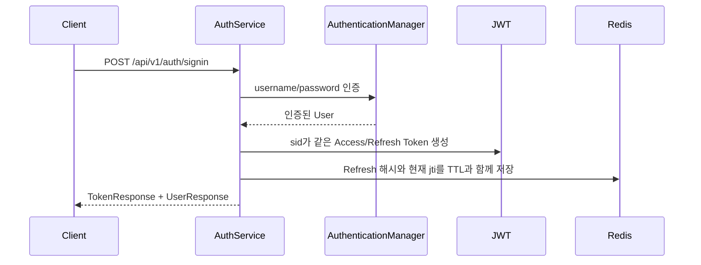
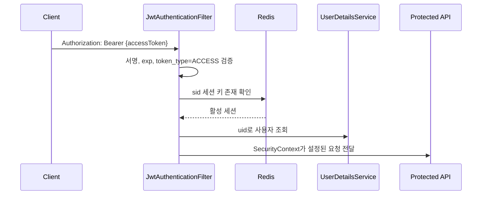
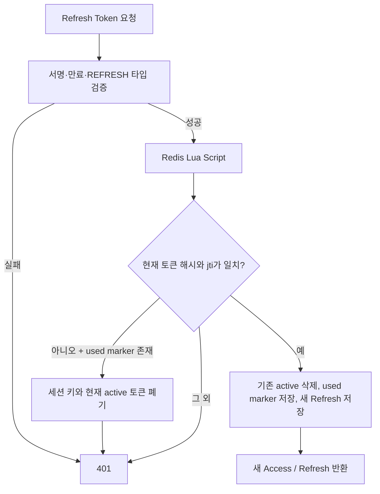

# Security JWT Authentication

Java 21, Spring Boot 4.1.1, Maven 멀티 모듈 기반의 JWT 인증 예제입니다. 회원가입·로그인·Access Token 인증·Refresh Token 재발급·로그아웃을 제공하며, Redis 기반 Refresh Token Rotation(RTR)으로 토큰 재사용 공격과 저장소 누적 문제를 다룹니다.

## 핵심 설계

- Access Token: 6시간 (`21,600,000ms`)
- Refresh Token: 로그인 시점부터 최대 2주 (`1,209,600,000ms`)
- Access/Refresh Token은 `token_type` 클레임으로 명확히 분리됩니다.
- 모든 로그인 세션에 `sid`, 모든 JWT에 `jti`를 부여합니다.
- Refresh Token 원문은 저장하지 않고 SHA-256 해시만 Redis에 보관합니다.
- 재발급은 Redis Lua Script로 원자적으로 처리합니다.
- 이미 사용한 Refresh Token이 다시 들어오면 재사용으로 판단하여 그 세션 전체를 폐기합니다.
- 보호 API는 Redis 세션 상태도 확인합니다. 따라서 로그아웃·재사용 감지 뒤에는 같은 세션의 Access Token도 즉시 사용할 수 없습니다.

Refresh Token의 재발급은 세션 만료를 연장하지 않습니다. 즉, 2주 동안 여러 번 재발급해도 Refresh Token의 최종 만료 시각은 최초 로그인 시점 기준 2주입니다. 장기 로그인 정책은 별도의 재인증 또는 새 로그인으로 설계합니다.

## 기술 스택

| 구분 | 기술 | 버전 / 역할 |
| --- | --- | --- |
| Language | Java | 21 |
| Framework | Spring Boot | 4.1.1 |
| Security | Spring Security | Stateless 인증·인가 |
| Persistence | Spring Data JPA / Hibernate | 사용자 저장 |
| Database | MySQL | 사용자 도메인 데이터 |
| Cache / Session State | Spring Data Redis / Lettuce | Refresh Token·세션 상태 |
| JWT | JJWT | 0.13.0 |
| Test | JUnit 5 / AssertJ / Mockito | 단위 테스트 |
| Build | Maven Wrapper | 멀티 모듈 빌드 |

## 모듈 구조

```text
security/
├── security-app/                         # 실행 애플리케이션, HTTP API
│   └── kr.kro.pay9um/
│       ├── config/                        # Spring Security, CORS, properties
│       ├── controller/                    # AuthController
│       ├── dto/                           # HTTP 요청/응답, Bean Validation
│       ├── exception/                     # HTTP 예외 응답 처리
│       ├── security/                      # JWT 인증 필터
│       └── service/
│           ├── AuthService                # 회원가입, 로그인, 재발급, 로그아웃
│           └── token/                     # Redis RTR 저장소와 Lua Script
├── security-jwt/                          # JWT 생성·서명 검증
│   └── kr.kro.pay9um.jwt/
│       ├── config/                        # JwtProperties
│       ├── provider/                      # JwtTokenProvider
│       ├── validator/                     # JwtTokenValidator
│       └── JwtPayload, TokenType, DTO
└── security-core/                         # 사용자 도메인과 공통 보안 모델
    └── kr.kro.pay9um.core/
        ├── common/                        # 도메인 예외, UID 생성기
        ├── domain/user/                   # User, Role, UserRepository
        └── security/                      # CustomUserDetails, UserDetailsService
```

의존성 방향은 단방향입니다. JWT 모듈은 사용자 도메인에 의존하지 않으므로 다른 프로젝트에서 재사용하기 쉽습니다.



## JWT와 Redis 데이터 설계

| 구분 | Access Token | Refresh Token |
| --- | --- | --- |
| `token_type` | `ACCESS` | `REFRESH` |
| 기본 만료 | 6시간 | 최초 로그인부터 2주 |
| API 용도 | 보호 API의 `Authorization` 헤더 | `/reissue`, `/logout` 요청 본문 |
| 서버 검증 | 서명, 만료, 타입, 활성 세션 | 서명, 만료, 타입, Redis 해시·현재 토큰 여부 |
| 로그아웃 후 | 세션 확인에서 즉시 거부 | Redis에서 즉시 폐기 |

모든 JWT에는 다음 Claim이 포함됩니다.

| Claim | 의미 |
| --- | --- |
| `sub` | 사용자 UID |
| `jti` | JWT별 UUID |
| `sid` | 로그인 세션 UUID |
| `token_type` | `ACCESS` 또는 `REFRESH` |
| `iat` / `exp` | 발급·만료 시각 |

Redis 키는 세션 단위 hash tag를 사용하므로 Redis Cluster에서도 재발급 Lua Script가 같은 슬롯에서 실행됩니다.

| 키 | 값 | TTL |
| --- | --- | --- |
| `auth:refresh:session:{sid}` | 현재 유효한 Refresh Token의 `jti` | Refresh Token의 남은 수명 |
| `auth:refresh:token:{sid}:jti` | Refresh Token의 SHA-256 해시 | Refresh Token의 남은 수명 |
| `auth:refresh:used:{sid}:jti` | 소비된 토큰의 세션 ID | Refresh Token의 남은 수명 |

Redis의 TTL이 끝나면 키가 자동 제거됩니다. 따라서 로그인·재발급·로그아웃이 반복되어도 MySQL의 `refresh_tokens` 테이블처럼 데이터가 무한히 쌓이지 않습니다.

## 인증 흐름

### 로그인



### 보호 API 호출



`token_type=REFRESH` 토큰은 인증 필터에서 절대 `Authentication`을 만들지 않으므로 보호 API를 호출할 수 없습니다.

### 재발급(RTR)과 재사용 감지



동일 Refresh Token으로 동시에 재발급을 요청하면 한 요청만 회전에 성공합니다. 뒤늦게 같은 토큰을 사용한 요청은 재사용으로 감지되어 해당 세션이 폐기됩니다. 이는 탈취된 이전 토큰이 새로 발급된 Refresh Token을 탈취하는 것을 막습니다.

## API

공통 경로는 `/api/v1/auth`입니다.

### 회원가입

`POST /api/v1/auth/signup`

```json
{
  "username": "user1234",
  "password": "Password1!",
  "passwordConfirm": "Password1!",
  "email": "user1234@example.com",
  "nickname": "사용자",
  "phoneNumber": "010-1234-5678"
}
```

성공하면 `201 Created`를 반환합니다. 중복된 아이디나 이메일은 `409 Conflict`입니다.

### 로그인

`POST /api/v1/auth/signin`

```json
{
  "username": "user1234",
  "password": "Password1!"
}
```

성공 응답 예시입니다.

```json
{
  "token": {
    "grantType": "Bearer",
    "accessToken": "eyJ...",
    "refreshToken": "eyJ...",
    "accessTokenExpiresIn": 21600000,
    "refreshTokenExpiresIn": 1209600000
  },
  "user": {
    "uid": "...",
    "username": "user1234",
    "email": "user1234@example.com",
    "nickname": "사용자",
    "phoneNumber": "010-1234-5678",
    "role": "USER"
  }
}
```

`refreshTokenExpiresIn`은 재발급할수록 감소합니다. 세션의 절대 만료 시각이 유지되기 때문입니다.

### 재발급과 로그아웃

`POST /api/v1/auth/reissue`와 `POST /api/v1/auth/logout`은 아래 본문을 사용합니다.

```json
{
  "refreshToken": "eyJ..."
}
```

- 재발급 성공: `200 OK`, 새 Access/Refresh Token 반환
- 로그아웃 성공: `204 No Content`, 해당 세션의 Access/Refresh Token 즉시 무효화
- 만료·위조·이미 폐기된 Refresh Token: `401 Unauthorized`
- Redis 연결 문제: 인증 API는 `503 Service Unavailable`

보호 API에는 다음 헤더를 사용합니다.

```http
Authorization: Bearer {accessToken}
```

## 로컬 실행

### 준비물

- JDK 21
- MySQL 서버와 데이터베이스
- Redis 서버 (Redis 6 이상 권장)
- IntelliJ IDEA 또는 Maven Wrapper 실행 환경

### 설정

저장소에는 실제 설정 파일을 올리지 않습니다. 먼저 예제 파일을 복사합니다.

```powershell
Copy-Item security-app/src/main/resources/application.yml.example security-app/src/main/resources/application.yml
```

그 다음 `application.yml`의 DB·JWT·Redis 값을 채웁니다. Redis 항목은 의도적으로 값이 비어 있습니다.

```yaml
spring:
  data:
    redis:
      host:
      port:
      username:
      password:
      database:
```

예제 설정에서는 다음 환경 변수를 사용할 수 있습니다.

| 변수 | 설명 |
| --- | --- |
| `DB_URL` | MySQL JDBC URL |
| `DB_USERNAME` / `DB_PASSWORD` | MySQL 접속 정보 |
| `JWT_SECRET_KEY` | 32바이트 이상인 HMAC 비밀키 |
| `REDIS_HOST` / `REDIS_PORT` | Redis 주소와 포트 |
| `REDIS_USERNAME` / `REDIS_PASSWORD` | Redis ACL 사용자·비밀번호. 사용하지 않으면 환경 변수도 비워 둡니다. |
| `REDIS_DATABASE` | 사용할 Redis logical database 번호 |

`JWT_SECRET_KEY`와 DB·Redis 비밀번호는 Git에 커밋하면 안 됩니다. 운영 환경에서는 TLS, Redis ACL, 별도 비밀 관리 도구를 적용하세요.

### 실행과 테스트

Windows PowerShell:

```powershell
.\mvnw.cmd spring-boot:run -pl security-app -am
.\mvnw.cmd test
```

macOS / Linux:

```bash
./mvnw spring-boot:run -pl security-app -am
./mvnw test
```

현재 단위 테스트는 토큰 타입 분리와 Refresh Token 회전·재사용·로그아웃 서비스 흐름을 검증합니다. Redis Lua Script는 실제 Redis 설정을 입력한 뒤 API 수준에서 함께 확인해야 합니다.

## 기존 DB Refresh Token 테이블을 사용한 경우

이전 구현의 `refresh_tokens` 엔티티, Repository, 정리 배치는 제거했습니다. `ddl-auto: update`는 더 이상 참조하지 않는 테이블을 자동으로 삭제하지 않습니다. 기존 테이블은 서비스 동작에 사용되지 않으므로, 백업과 동작 확인을 마친 뒤 필요할 때만 직접 삭제하세요.

```sql
DROP TABLE refresh_tokens;
```

위 SQL은 데이터를 영구 삭제하므로, 운영 DB에서는 Flyway 또는 Liquibase 마이그레이션으로 검토·승인 과정을 거쳐 실행하는 것이 안전합니다.

## 다음 확장 지점

- 로그인·재발급 API에 IP/계정 기반 rate limiting과 감사 로그 추가
- JWT `issuer`, `audience`, `kid` 및 키 회전 정책 추가
- 브라우저 기반 서비스라면 Refresh Token을 HttpOnly·Secure·SameSite Cookie로 전달하도록 API 계약 변경
- 사용자별 활성 세션 목록과 전체 로그아웃 기능 추가
- Testcontainers Redis/MySQL 기반 통합 테스트와 동시 재발급 테스트 추가
- 운영 환경에서 `ddl-auto: validate`와 Flyway/Liquibase 마이그레이션 사용
