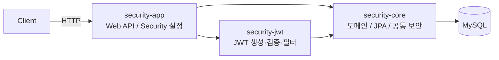
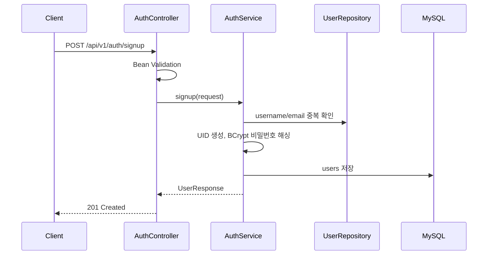
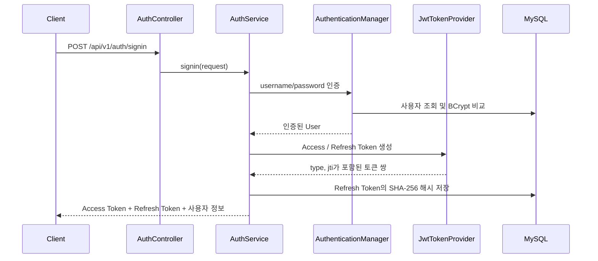
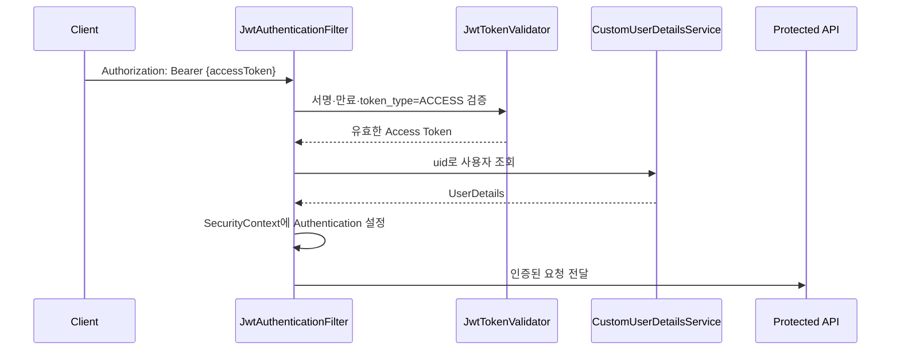
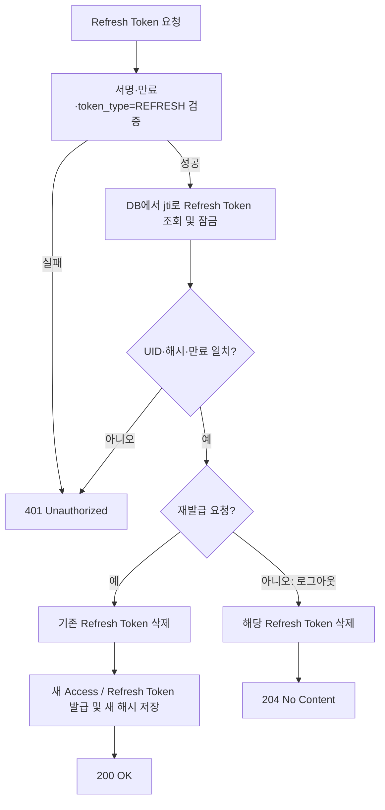

# Security JWT Authentication

Java 21과 Spring Boot 4.1.1 기반의 Maven 멀티 모듈 인증 서버 예제입니다. Spring Security와 JWT(JSON Web Token)를 사용해 회원가입, 로그인, Access Token 인증, Refresh Token 재발급 및 로그아웃을 제공합니다.

Refresh Token은 서버 DB에 **평문이 아닌 SHA-256 해시**로 저장하고, 재발급 시 기존 토큰을 폐기한 뒤 새 토큰 쌍을 발급하는 회전(rotation) 방식을 사용합니다.

## 문서

- [사용·확장·운영 가이드](docs/USAGE_GUIDE.md): 실행, API 연동, 클라이언트 토큰 처리, 기능 확장, 배포 및 GitHub 관리
- [설정 예제](security-app/src/main/resources/application.yml.example): clone 후 복사해 사용하는 로컬 설정 템플릿

## 핵심 기능

- 사용자 회원가입 및 입력값 검증
- `username` / 비밀번호 기반 로그인
- BCrypt 비밀번호 해싱
- Access Token과 Refresh Token의 명시적 용도 분리
- Refresh Token 재발급 및 토큰 회전
- Refresh Token 기반 로그아웃(서버 저장 토큰 폐기)
- Spring Security의 Stateless 인증
- CORS 설정 및 전역 예외 응답

## 기술 스택

| 구분 | 기술 | 버전 / 비고 |
| --- | --- | --- |
| Language | Java | 21 |
| Framework | Spring Boot | 4.1.1 |
| Security | Spring Security | Spring Boot 관리 버전 |
| Persistence | Spring Data JPA / Hibernate | Spring Boot 관리 버전 |
| Database | MySQL | MySQL Connector/J |
| JWT | JJWT | 0.13.0 |
| Build | Maven Wrapper | Maven 멀티 모듈 |
| Utility | Lombok | Spring Boot 관리 버전 |
| Test | JUnit 5 / AssertJ | Spring Boot Starter Test |

## 아키텍처



의존성은 아래 방향으로만 유지합니다. `security-core`는 하위 계층이므로 JWT나 웹 API 모듈에 의존하지 않습니다.

```text
security-app ──> security-jwt ──> security-core
      └────────────────────────> security-core
```

## 멀티 모듈 구성

```text
security/                                  # 부모 POM, 공통 빌드 설정
├── security-core/                         # 도메인 및 영속성 계층
│   └── kr.kro.pay9um.core/
│       ├── common/exception/              # 전역 예외 처리, Refresh Token 예외
│       ├── common/util/                   # UID 생성기
│       ├── domain/user/                   # User, Role, UserRepository
│       ├── domain/token/                  # RefreshToken, RefreshTokenRepository
│       └── security/                      # UserDetails, UserDetailsService
│
├── security-jwt/                          # JWT 인프라 계층
│   └── kr.kro.pay9um.jwt/
│       ├── config/                        # JwtProperties
│       ├── provider/                      # JwtTokenProvider
│       ├── validator/                     # JwtTokenValidator
│       ├── filter/                        # JwtAuthenticationFilter
│       ├── dto/response/                  # TokenResponse
│       └── TokenType                      # ACCESS / REFRESH
│
└── security-app/                          # 실행 애플리케이션 및 API 계층
    └── kr.kro.pay9um/
        ├── SecurityApplication            # Spring Boot 진입점
        ├── config/                        # SecurityConfig, SecurityProperties
        ├── controller/                    # AuthController
        ├── service/                       # AuthService
        └── dto/                           # 요청, 응답, 유효성 검증
```

## 인증 데이터 흐름

### 1. 회원가입



### 2. 로그인 및 토큰 발급



### 3. 보호된 API 호출



`token_type=REFRESH`인 토큰은 필터에서 인증을 만들지 않으므로, Refresh Token으로 보호 API에 접근할 수 없습니다.

### 4. 토큰 재발급과 로그아웃



재발급 과정에서 DB 행에 비관적 잠금을 사용합니다. 동시에 같은 Refresh Token으로 재발급을 시도해도 한 요청만 성공하고, 먼저 사용된 토큰은 즉시 삭제됩니다.

## JWT 설계

두 토큰은 같은 서명 키를 사용하지만, 용도와 서버 검증 방식이 다릅니다.

| 항목 | Access Token | Refresh Token |
| --- | --- | --- |
| `token_type` 클레임 | `ACCESS` | `REFRESH` |
| 기본 만료 시간 | 1시간 | 1일 |
| 용도 | 보호 API 인증 | `/reissue`, `/logout` |
| 서버 DB 저장 | 하지 않음 | SHA-256 해시 저장 |
| 필터 인증 허용 | 허용 | 거부 |
| 재발급 후 상태 | 기존 토큰 유지(만료까지) | 기존 토큰 즉시 폐기 |

모든 JWT에는 다음 정보가 들어갑니다.

| Claim | 설명 |
| --- | --- |
| `sub` | 사용자 UID |
| `jti` | UUID 기반 토큰 고유 ID |
| `token_type` | `ACCESS` 또는 `REFRESH` |
| `iat` | 발급 시각 |
| `exp` | 만료 시각 |

> 로그아웃은 Refresh Token을 폐기합니다. 이미 전달된 Access Token은 Stateless JWT 특성상 만료될 때까지 유효합니다. 즉시 Access Token까지 차단해야 하는 요구사항이 생기면 별도의 차단 목록(redis 등)을 추가해야 합니다.

## 데이터 모델

### `users`

| 컬럼 | 설명 | 제약 |
| --- | --- | --- |
| `id` | 내부 PK | Auto Increment |
| `uid` | 외부 노출용 사용자 식별자 | Unique, 변경 불가 |
| `username` | 로그인 아이디 | Unique |
| `password` | BCrypt 해시 비밀번호 | 평문 저장 금지 |
| `email` | 이메일 | Unique |
| `nickname` | 닉네임 | - |
| `phone_number` | 전화번호 | - |
| `role` | `USER` / `ADMIN` | Enum String |

### `refresh_tokens`

| 컬럼 | 설명 |
| --- | --- |
| `token_id` | JWT `jti`, PK |
| `uid` | 토큰 소유자 UID |
| `token_hash` | Refresh Token SHA-256 해시 |
| `expires_at` | 서버 측 만료 시각 |

## API

기본 주소는 `http://localhost:8080`이며, 인증 API의 공통 경로는 `/api/v1/auth`입니다.

### 회원가입

`POST /api/v1/auth/signup`

```json
{
  "username": "user1234",
  "password": "Password1!",
  "passwordConfirm": "Password1!",
  "email": "user1234@example.com",
  "nickname": "사용자",
  "phoneNumber": "010-1234-5678"
}
```

성공 시 `201 Created`와 사용자 정보를 반환합니다. 아이디는 4~16자의 영문 소문자·숫자만 허용하며, 비밀번호는 8~20자이고 영문·숫자·특수문자를 각각 하나 이상 포함해야 합니다.

### 로그인

`POST /api/v1/auth/signin`

```json
{
  "username": "user1234",
  "password": "Password1!"
}
```

성공 시 `200 OK`를 반환합니다.

```json
{
  "token": {
    "grantType": "Bearer",
    "accessToken": "eyJ...",
    "refreshToken": "eyJ...",
    "accessTokenExpiresIn": 3600000
  },
  "user": {
    "uid": "...",
    "username": "user1234",
    "email": "user1234@example.com",
    "nickname": "사용자",
    "phoneNumber": "010-1234-5678",
    "role": "USER"
  }
}
```

### 토큰 재발급

`POST /api/v1/auth/reissue`

```json
{
  "refreshToken": "eyJ..."
}
```

성공 시 `200 OK`와 **새로운 Access Token 및 Refresh Token 쌍**을 반환합니다. 이전 Refresh Token은 더 이상 사용할 수 없습니다.

### 로그아웃

`POST /api/v1/auth/logout`

```json
{
  "refreshToken": "eyJ..."
}
```

성공 시 `204 No Content`를 반환합니다. 해당 Refresh Token은 DB에서 삭제되어 재발급에 사용할 수 없습니다.

### 보호 API 호출 형식

```http
Authorization: Bearer {accessToken}
```

## 실행 방법

### 1. 사전 요구 사항

- JDK 21
- MySQL 서버 및 생성된 데이터베이스
- IntelliJ IDEA 또는 Maven 실행 환경

### 2. 환경 변수 설정

환경 변수를 설정하면 `application.yml`의 테스트 기본값보다 우선 적용됩니다.

| 변수 | 설명 | 예시 |
| --- | --- | --- |
| `DB_URL` | JDBC 연결 문자열 | `jdbc:mysql://localhost:3306/workspace_security?serverTimezone=Asia/Seoul&characterEncoding=UTF-8` |
| `DB_USERNAME` | DB 사용자명 | `security_app` |
| `DB_PASSWORD` | DB 비밀번호 | 별도 관리 |
| `JWT_SECRET_KEY` | HMAC 서명 비밀키 | 32바이트 이상 임의 문자열 |

IntelliJ IDEA에서는 **Run → Edit Configurations → Environment variables**에 위 값을 입력합니다. `JWT_SECRET_KEY`는 충분히 긴 무작위 값으로 생성하고 외부에 노출하지 않아야 합니다.

### 3. 실행

Windows PowerShell:

```powershell
.\mvnw.cmd spring-boot:run -pl security-app -am
```

macOS / Linux:

```bash
./mvnw spring-boot:run -pl security-app -am
```

애플리케이션은 기본적으로 `8080` 포트에서 시작합니다.

### 테스트

```powershell
.\mvnw.cmd test
```

`security-jwt` 모듈의 테스트는 Access Token과 Refresh Token이 서로의 용도로 검증되지 않는지 확인합니다.

## 보안 및 운영 메모

- 현재 `application.yml`의 테스트 기본값은 환경 변수로 덮어쓸 수 있습니다. 공개 저장소로 전환하기 전 실제 비밀 값은 반드시 교체하고 제거해야 합니다. 자세한 절차는 [사용·확장·운영 가이드](docs/USAGE_GUIDE.md)를 참고하세요.
- Refresh Token은 DB에 해시로만 보관하므로 DB가 노출돼도 원문 토큰을 바로 사용할 수 없습니다.
- 회원가입 중복 확인은 사용자 경험을 위한 검사이며, DB의 Unique 제약 조건도 함께 최종 방어선으로 동작합니다.
- JPA 설정은 현재 `ddl-auto: update`입니다. 운영 환경에서는 스키마 변경을 마이그레이션 도구(Flyway 또는 Liquibase)로 관리하고 `validate`로 전환하는 것을 권장합니다.
- 만료된 Refresh Token 행은 재발급에 사용할 수 없습니다. `RefreshTokenCleanupService`가 매일 03:00에 만료 행을 삭제합니다. 필요하면 `app.security.refresh-token-cleanup-cron` 환경 속성으로 실행 시각을 변경할 수 있습니다.
